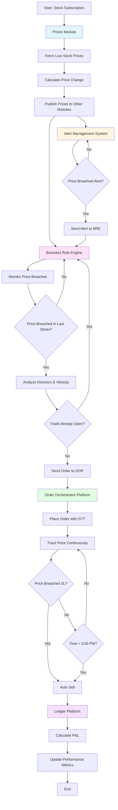

# Overall System Flow

```mermaid
flowchart TD
    A[Start: Stock Subscription] --> B[Prices Module]
    B --> C[Fetch Live Stock Prices]
    C --> D[Calculate Price Change]
    D --> E[Publish Prices to Other Modules]
    
    E --> F[Alert Management System]
    E --> G[Business Rule Engine]
    
    F --> H{Price Breached Alert?}
    H -->|Yes| I[Send Alert to BRE]
    H -->|No| F
    
    G --> J[Monitor Price Breaches]
    J --> K{Price Breached in Last 20min?}
    K -->|Yes| L[Analyze Direction & Velocity]
    K -->|No| G
    
    L --> M{Trade Already Open?}
    M -->|No| N[Send Order to OOP]
    M -->|Yes| G
    
    N --> O[Order Orchestrator Platform]
    O --> P[Place Order with GTT]
    P --> Q[Track Price Continuously]
    
    Q --> R{Price Breached SL?}
    R -->|Yes| S[Auto Sell]
    R -->|No| T{Time > 3:00 PM?}
    T -->|Yes| S
    T -->|No| Q
    
    S --> U[Ledger Platform]
    U --> V[Calculate P&L]
    V --> W[Update Performance Metrics]
    W --> X[End]
    
    I --> G
    
    style B fill:#e1f5ff
    style F fill:#fff4e1
    style G fill:#ffe1f5
    style O fill:#e1ffe1
    style U fill:#f5e1ff
```

