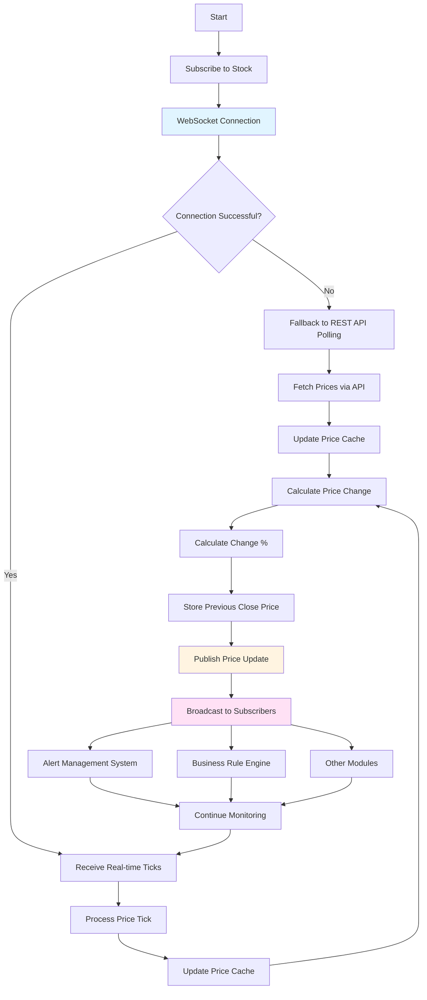

# Prices Module Flow

```mermaid
flowchart TD
    A[Start] --> B[Subscribe to Stock]
    B --> C[WebSocket Connection]
    C --> D{Connection Successful?}
    D -->|No| E[Fallback to REST API Polling]
    D -->|Yes| F[Receive Real-time Ticks]
    
    E --> G[Fetch Prices via API]
    G --> H[Update Price Cache]
    
    F --> I[Process Price Tick]
    I --> J[Update Price Cache]
    
    H --> K[Calculate Price Change]
    J --> K
    
    K --> L[Calculate Change %]
    L --> M[Store Previous Close Price]
    M --> N[Publish Price Update]
    
    N --> O[Broadcast to Subscribers]
    O --> P[Alert Management System]
    O --> Q[Business Rule Engine]
    O --> R[Other Modules]
    
    P --> S[Continue Monitoring]
    Q --> S
    R --> S
    S --> F
    
    style C fill:#e1f5ff
    style N fill:#fff4e1
    style O fill:#ffe1f5
```

