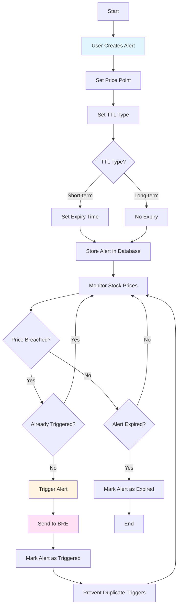

# Alert Management System Flow

```mermaid
flowchart TD
    A[Start] --> B[User Creates Alert]
    B --> C[Set Price Point]
    C --> D[Set TTL Type]
    D --> E{TTL Type?}
    E -->|Short-term| F[Set Expiry Time]
    E -->|Long-term| G[No Expiry]
    
    F --> H[Store Alert in Database]
    G --> H
    
    H --> I[Monitor Stock Prices]
    I --> J{Price Breached?}
    J -->|No| K{Alert Expired?}
    K -->|Yes| L[Mark Alert as Expired]
    K -->|No| I
    
    J -->|Yes| M{Already Triggered?}
    M -->|Yes| I
    M -->|No| N[Trigger Alert]
    
    N --> O[Send to BRE]
    O --> P[Mark Alert as Triggered]
    P --> Q[Prevent Duplicate Triggers]
    Q --> I
    
    L --> R[End]
    
    style B fill:#e1f5ff
    style N fill:#fff4e1
    style O fill:#ffe1f5
```

