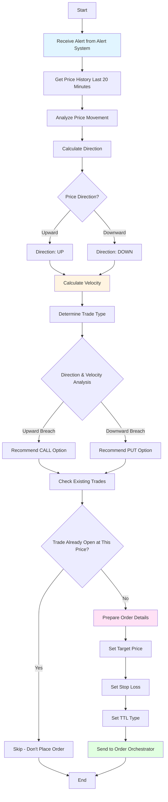

# Business Rule Engine (BRE) Flow

```mermaid
flowchart TD
    A[Start] --> B[Receive Alert from Alert System]
    B --> C[Get Price History Last 20 Minutes]
    C --> D[Analyze Price Movement]
    
    D --> E[Calculate Direction]
    E --> F{Price Direction?}
    F -->|Upward| G[Direction: UP]
    F -->|Downward| H[Direction: DOWN]
    
    G --> I[Calculate Velocity]
    H --> I
    
    I --> J[Determine Trade Type]
    J --> K{Direction & Velocity Analysis}
    K -->|Upward Breach| L[Recommend CALL Option]
    K -->|Downward Breach| M[Recommend PUT Option]
    
    L --> N[Check Existing Trades]
    M --> N
    
    N --> O{Trade Already Open at This Price?}
    O -->|Yes| P[Skip - Don't Place Order]
    O -->|No| Q[Prepare Order Details]
    
    Q --> R[Set Target Price]
    R --> S[Set Stop Loss]
    S --> T[Set TTL Type]
    T --> U[Send to Order Orchestrator]
    
    P --> V[End]
    U --> V
    
    style B fill:#e1f5ff
    style I fill:#fff4e1
    style Q fill:#ffe1f5
    style U fill:#e1ffe1
```

