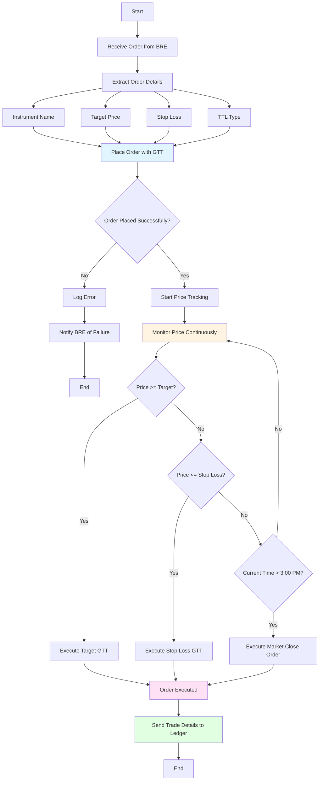

# Order Orchestrator Platform Flow

```mermaid
flowchart TD
    A[Start] --> B[Receive Order from BRE]
    B --> C[Extract Order Details]
    C --> D[Instrument Name]
    C --> E[Target Price]
    C --> F[Stop Loss]
    C --> G[TTL Type]
    
    D --> H[Place Order with GTT]
    E --> H
    F --> H
    G --> H
    
    H --> I{Order Placed Successfully?}
    I -->|No| J[Log Error]
    I -->|Yes| K[Start Price Tracking]
    
    J --> L[Notify BRE of Failure]
    L --> M[End]
    
    K --> N[Monitor Price Continuously]
    N --> O{Price >= Target?}
    O -->|Yes| P[Execute Target GTT]
    O -->|No| Q{Price <= Stop Loss?}
    
    Q -->|Yes| R[Execute Stop Loss GTT]
    Q -->|No| S{Current Time > 3:00 PM?}
    
    S -->|Yes| T[Execute Market Close Order]
    S -->|No| N
    
    P --> U[Order Executed]
    R --> U
    T --> U
    
    U --> V[Send Trade Details to Ledger]
    V --> W[End]
    
    style H fill:#e1f5ff
    style N fill:#fff4e1
    style U fill:#ffe1f5
    style V fill:#e1ffe1
```

