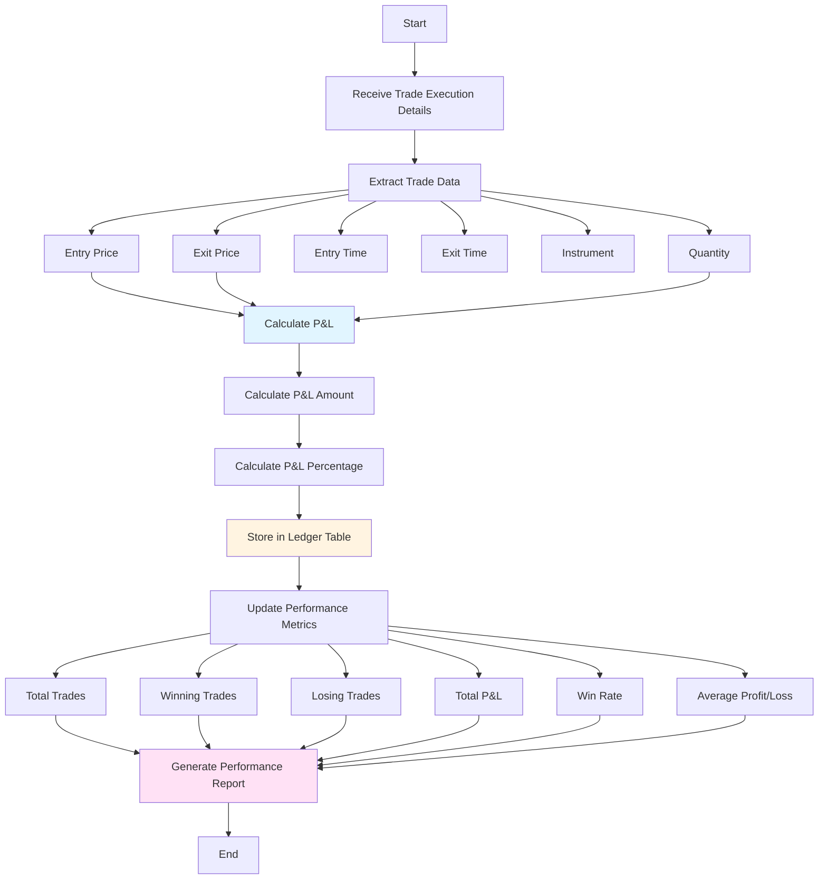

# Ledger Platform Flow

```mermaid
flowchart TD
    A[Start] --> B[Receive Trade Execution Details]
    B --> C[Extract Trade Data]
    C --> D[Entry Price]
    C --> E[Exit Price]
    C --> F[Entry Time]
    C --> G[Exit Time]
    C --> H[Instrument]
    C --> I[Quantity]
    
    D --> J[Calculate P&L]
    E --> J
    I --> J
    
    J --> K[Calculate P&L Amount]
    K --> L[Calculate P&L Percentage]
    L --> M[Store in Ledger Table]
    
    M --> N[Update Performance Metrics]
    N --> O[Total Trades]
    N --> P[Winning Trades]
    N --> Q[Losing Trades]
    N --> R[Total P&L]
    N --> S[Win Rate]
    N --> T[Average Profit/Loss]
    
    O --> U[Generate Performance Report]
    P --> U
    Q --> U
    R --> U
    S --> U
    T --> U
    
    U --> V[End]
    
    style J fill:#e1f5ff
    style M fill:#fff4e1
    style U fill:#ffe1f5
```

