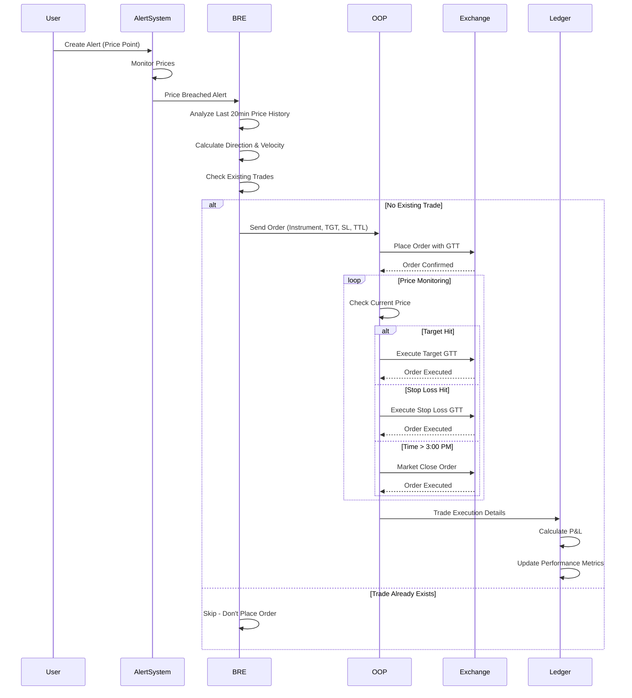

# Complete Trade Execution Sequence Diagram

```mermaid
sequenceDiagram
    participant User
    participant AlertSystem
    participant BRE
    participant OOP
    participant Exchange
    participant Ledger
    
    User->>AlertSystem: Create Alert (Price Point)
    AlertSystem->>AlertSystem: Monitor Prices
    AlertSystem->>BRE: Price Breached Alert
    
    BRE->>BRE: Analyze Last 20min Price History
    BRE->>BRE: Calculate Direction & Velocity
    BRE->>BRE: Check Existing Trades
    
    alt No Existing Trade
        BRE->>OOP: Send Order (Instrument, TGT, SL, TTL)
        OOP->>Exchange: Place Order with GTT
        Exchange-->>OOP: Order Confirmed
        
        loop Price Monitoring
            OOP->>OOP: Check Current Price
            alt Target Hit
                OOP->>Exchange: Execute Target GTT
                Exchange-->>OOP: Order Executed
            else Stop Loss Hit
                OOP->>Exchange: Execute Stop Loss GTT
                Exchange-->>OOP: Order Executed
            else Time > 3:00 PM
                OOP->>Exchange: Market Close Order
                Exchange-->>OOP: Order Executed
            end
        end
        
        OOP->>Ledger: Trade Execution Details
        Ledger->>Ledger: Calculate P&L
        Ledger->>Ledger: Update Performance Metrics
    else Trade Already Exists
        BRE->>BRE: Skip - Don't Place Order
    end
```

