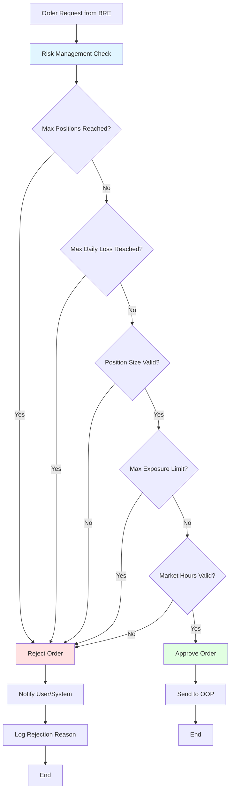

# Risk Management Module (Recommended Addition)

## Risk Management Rules

1. **Position Limits**
   - Maximum number of open positions per instrument
   - Maximum number of total open positions
   - Maximum position size per trade

2. **Loss Limits**
   - Maximum daily loss limit
   - Maximum loss per instrument
   - Maximum drawdown threshold

3. **Exposure Limits**
   - Maximum total exposure
   - Maximum exposure per instrument
   - Maximum leverage

4. **Time-based Rules**
   - Trading hours validation
   - Market close time (3:00 PM)
   - Pre-market and post-market restrictions

